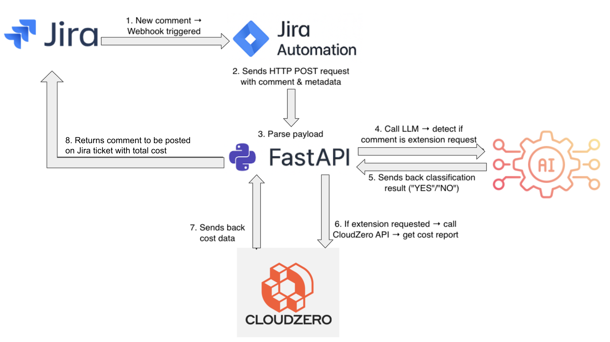
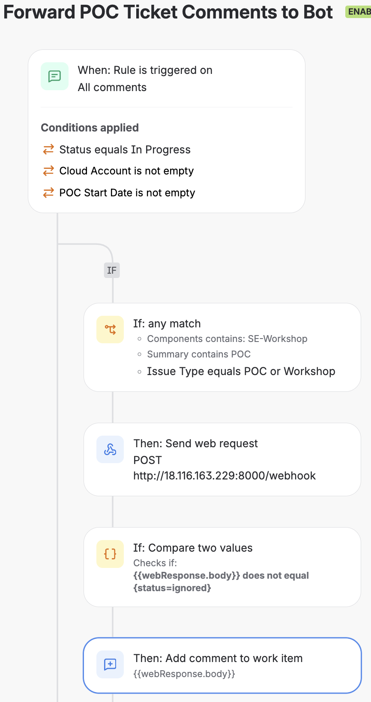

# Jira Automation: Detect Extension Request & Comment Current Spend

## Architecture Diagram


## Jira Automation Rule Settings



Web request URL: ```http://<public IP of node>:8000/webhook```

HTTP method: POST

Web request body: Custom Data

Custom Data:
```
{
"key": "{{issue.key}}",
"cloud_account": "{{issue.customfield_12645}}",
"cloud_account_region": "{{issue.customfield_12646}}",
"start_date": "{{issue.customfield_11432}}",
"comment": {{comment.body.asJsonString}},
"author": {{comment.author.emailAddress}}
}
```

## FastAPI app
Only comments if extension requested and comment is not from a member of the GOES team.

## Run app
To run app:
```
uvicorn main:app --reload --host 0.0.0.0 --port 8000
```

Jira API Integration:
- Uses a Jira account to post comments.
- Token stored securely in environment variables.
